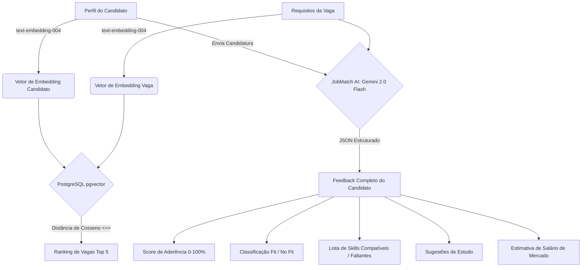

# 🚀 JobSpark — Plataforma de Recrutamento Inteligente

> Uma alternativa moderna, transparente e focada em experiência de uso (UX) para concorrer diretamente com a Gupy.io. Com **IA Bidirecional**, tanto as empresas quanto os candidatos têm total clareza sobre o nível de compatibilidade em cada vaga.

---

## 💻 Link de Produção
A aplicação está implantada e rodando na nuvem em:
* **Frontend**: [https://jobspark-frontend-231292456749.southamerica-east1.run.app/](https://jobspark-frontend-231292456749.southamerica-east1.run.app/)

---

## 🎯 Diferenciais e Funcionalidades

### 🧠 JobMatch AI (Análise Transparente de Match)
Esqueça a "caixa preta" de triagem automatizada. O JobSpark utiliza IA generativa para gerar feedbacks estruturados:
* **Score de Aderência Real**: Análise aprofundada de fit de 0% a 100%.
* **Classificação Automática**: Divisão transparente entre candidatos classificados como **Fit** ou **No Fit**.
* **Mapeamento de Competências**: Comparativo instantâneo exibindo quais competências são compatíveis e quais estão faltando.
* **Plano de Desenvolvimento**: Recomendações de estudo personalizadas criadas pela IA baseadas nas tecnologias exigidas na vaga.
* **Estimativa de Faixa Salarial**: Análise salarial baseada nas exigências da vaga e mercado atual.

### 🏆 Ranking Inteligente de Vagas (Top 5)
Usando busca vetorial semântica de alto desempenho, os candidatos têm acesso a uma barra lateral dinâmica que calcula em tempo real as **Top 5 vagas ideais** para o perfil cadastrado.

### ⚡ Candidatura em 1-Clique
Salve seu currículo e informações uma única vez. Chega de preencher formulários de 5 páginas a cada nova inscrição.

---

## 🛠️ Stack Tecnológica

### Frontend
* **Next.js 15** (App Router & Standalone build)
* **Tailwind CSS v4** (Design system otimizado e responsivo)
* **Lucide Icons** & **Zustand** (Gerenciamento de estado global)

### Backend & Banco de Dados
* **Bun Runtime** (Altamente veloz)
* **Hono.js** (Roteador de rotas de baixíssima latência)
* **Prisma ORM** (Modelagem de dados)
* **PostgreSQL + pgvector** (Armazenamento de vetores de alta precisão)
* **Redis** (Filas e cache de performance)

### Inteligência Artificial (Google Gemini)
* **text-embedding-004**: Geração de embeddings de 768 dimensões para buscas semânticas.
* **gemini-2.0-flash**: Motor de análise estruturada de currículos e requisitos.

---

## 🧠 Arquitetura do JobMatch AI

O fluxo abaixo demonstra como a inteligência artificial do Gemini 2.0 Flash e o banco de dados PostgreSQL (`pgvector`) se comunicam para calcular o fit ideal:



---

## 🚀 Como Rodar Localmente

### Pré-requisitos
* Docker instalado
* Bun instalado (para rodar o backend)
* Node.js v20+ instalado (para rodar o frontend)

### 1. Iniciar Infraestrutura (Banco de Dados e Redis)
```bash
cd infra
docker compose up -d
```

### 2. Configurar o Backend
Acesse a pasta `backend`, crie um arquivo `.env` baseado no `.env.example` e configure as credenciais:
```bash
cd ../backend
bun install
bunx prisma migrate deploy
bun dev
```

### 3. Configurar o Frontend
Acesse a pasta `frontend`, instale as dependências e inicie o Next.js:
```bash
cd ../frontend
npm install
npm run dev
```
Acesse a interface local em: **[http://localhost:3000](http://localhost:3000)**.

---

## ☁️ Implantação e Produção (GCP Cloud Run)

Este projeto foi construído para rodar em containers leves e escaláveis na nuvem do Google:

* **Build das Imagens**: Executado via **GCP Cloud Build** injetando variáveis de ambiente em tempo de compilação.
* **Hospedagem**: Imagens Docker rodando no **Google Cloud Run** com auto-scaling ativado e baixa latência na região de São Paulo (`southamerica-east1`).
